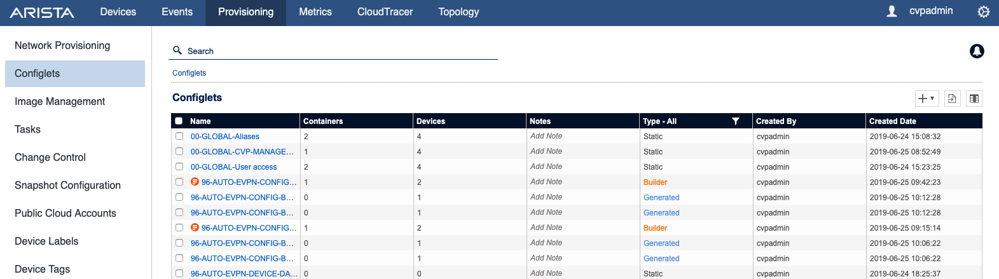
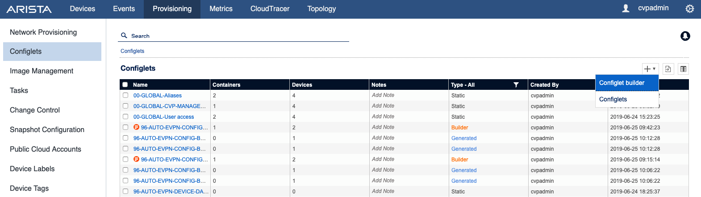
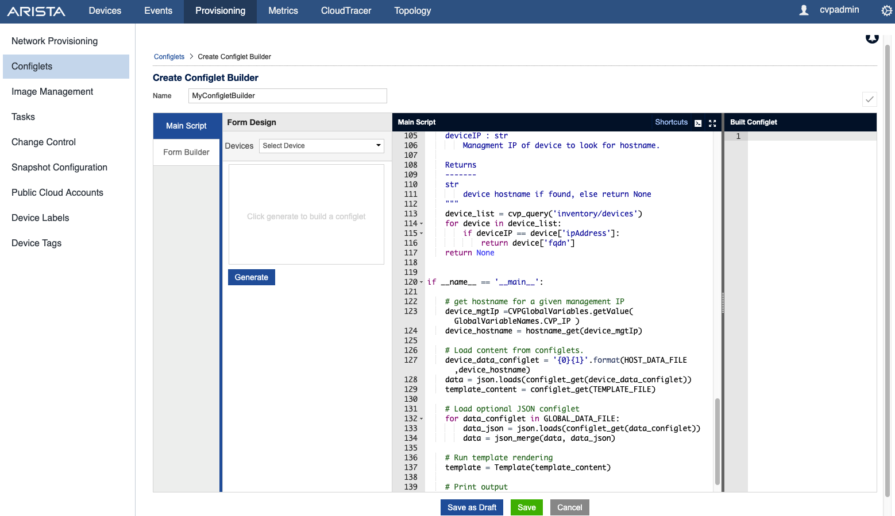
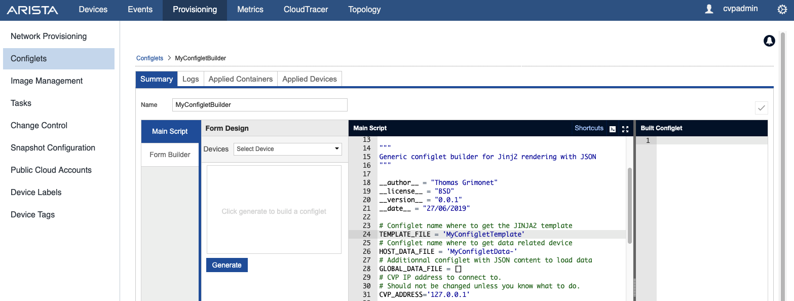
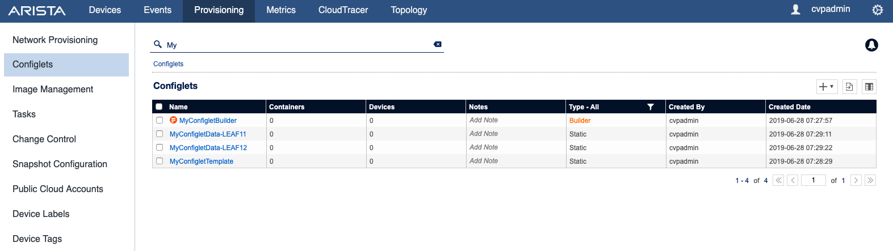
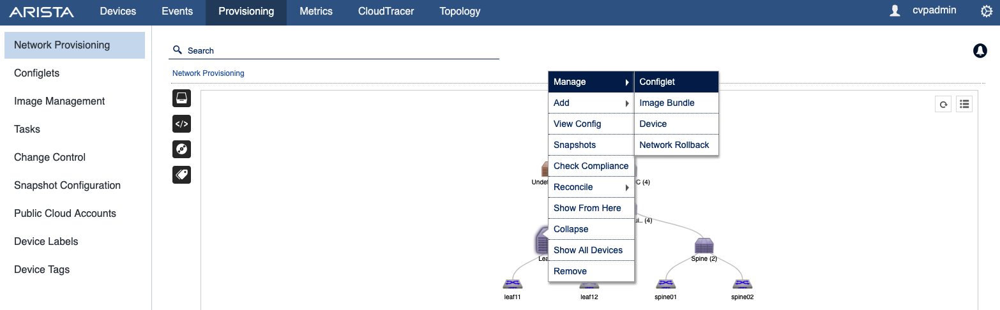
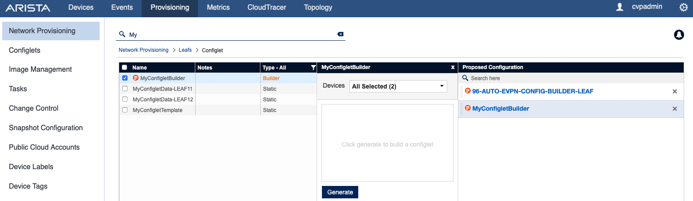
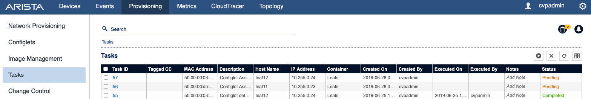

# Generic CloudVision Configlet Builder

__WARNING: Because of some internal changes in CVP >= 2022, this repository is not working anymore and will remain visibile in archive mode for information purpose only.__

## Overview

This repository provides a generic [configlet builder](https://www.arista.com/en/cg-cv/cv-creating-configlets#ww1185504) to render a JINJA2 template configured in a configlet and load all datas from a list of static configlets with JSON content.

This configlet works with the following workflow:

- One configlet with Jinja2 template content
- One configlet with JSON data per host. Its name should be something like that: `my-data-configlet$HOSTNAME$` where you can custom `my-data-configlet` string
- An optional list of generic configlet with JSON data to load.

Some example files are available under [examples](examples) folder

## Installation

1. To install this configlet builder, open your browser and go to : `https://CVP_ADDRESS/cv/provisioning/configlet` 



2. Click on Add Configlet Builder:



3. Copy and paste content of [configlet-builder.py](configlet-builder.py)



4. Update information to match your files:

- Configlet with template content
- Configlet with specific `json` data for host
- List of all configlet with generic `json` data to load
- (Optional) IP Address of your CVP server.



```python
# Configlet name where to get the JINJA2 template
TEMPLATE_FILE = '10-TEMPLATE-LEAF'
# Configlet name where to get data related device
HOST_DATA_FILE = '10-DATA-'
# Additionnal configlet with JSON content to load data
GLOBAL_DATA_FILE = []
# CVP IP address to connect to. 
# Should not be changed unless you know what to do.
CVP_ADDRESS='127.0.0.1'
```
5. Final list of configlets



## Usage

1. Attach your configlet to a container:



2. Generate configuration for this specific container:



3. Deploy configlet results



## License

Project is published under [BSD License](LICENSE).

## Ask question or report issue

Please open an issue on Github this is the fastest way to get an answer.

## Contribute

Contributing pull requests are gladly welcomed for this repository. If
you are planning a big change, please start a discussion first to make
sure we’ll be able to merge it.
